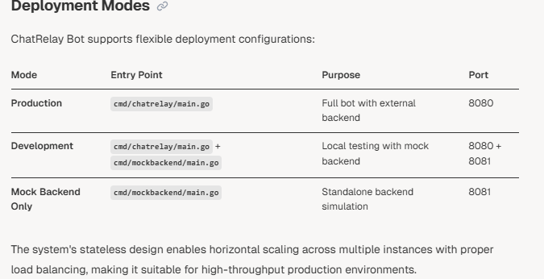

# 📝 Purpose and Scope

This document provides a comprehensive overview of the **ChatRelay Bot** system, a high-performance Slack bot implementation written in Go. The system demonstrates robust architectural patterns including comprehensive observability, concurrency handling, and enterprise-grade reliability features.

ChatRelay Bot serves as a relay service that receives user queries via Slack mentions, forwards them to configurable chat backend services, and streams responses back to users in real-time. The system includes a complete mock backend for development and testing scenarios.

For detailed information about specific components, see **Core Components**. For configuration details, see **Configuration**. For development setup and the mock backend, see **Development**.

---

# 🏗️ System Architecture

The ChatRelay Bot system follows a **modular architecture** with clear separation of concerns across multiple components:

# Message Processing Flow

The system processes Slack mentions through a well-defined pipeline that demonstrates the integration between all major components:

# Technology Stack

ChatRelay Bot leverages a modern Go technology stack optimized for performance, observability, and reliability:

## 🧩 Key Dependencies

The system relies on several critical dependencies for its core functionality:

- **Slack SDK**: [`slack-go/slack` v0.17.1](https://github.com/slack-go/slack) — Provides Socket Mode WebSocket connectivity and Slack API integration.
- **OpenTelemetry**: Comprehensive observability stack including gRPC/HTTP exporters, host metrics, and runtime instrumentation.
- **Configuration Management**: [`joho/godotenv` v1.5.1](https://github.com/joho/godotenv) — Enables flexible, environment-based configuration management.

# Core Features
## Real-Time Event Processing

The system uses Slack's Socket Mode to establish persistent WebSocket connections, enabling real-time processing of app_mention events without requiring public HTTP endpoints. This approach simplifies deployment and enhances security by eliminating inbound connection requirements.

## Simulated Response Streaming
ChatRelay Bot implements an intelligent response streaming mechanism that enhances user experience by providing progressive updates. The system splits backend responses into logical chunks and updates Slack messages incrementally with visual indicators (...) to simulate real-time streaming.

## 📊 Enterprise-Grade Observability

Built-in **OpenTelemetry** integration provides comprehensive observability including:

- **Distributed Tracing**: End-to-end request tracking from Slack events to backend responses.
- **Structured Logging**: Correlated logs with trace context using Go's `slog` package.
- **Runtime Metrics**: Go-specific metrics including garbage collection and goroutine monitoring.
- **Host Metrics**: System-level tracking of CPU, memory, and disk utilization.

## 🛡️ Resilience and Error Handling

The system implements multiple layers of resilience to ensure high availability and fault tolerance:

- **Retry Mechanisms**: Configurable retry logic for both Slack API and backend communications.
- **Context Cancellation**: Proper request timeout and cancellation handling using Go's context propagation.
- **Graceful Error Recovery**: Intelligent error handling that maintains system stability and avoids cascading failures.

## Development Support
A complete mock backend service enables local development and testing without external dependencies. The mock service simulates realistic chat backend behavior including response delays and various response formats.

# Configuration(Locally)

## ⚙️ Configuration Overview

This document provides a comprehensive guide to configuring the **ChatRelay Bot** system, including:

- Environment variables
- Authentication tokens
- Network settings
- Operational parameters

It covers both required and optional configuration options, their sources, validation rules, and usage throughout the system.

📌 For detailed information about the data structures used to hold configuration, see **[Data Models](#)**.  
💻 For development-specific setup procedures, refer to **[Local Setup](#)**.

The ChatRelay Bot uses a hierarchical configuration system that prioritizes environment variables over .env file settings. Configuration is loaded during application startup and validated before the system begins operation.

## 📥 Configuration Sources

The system loads configuration from two sources, in order of precedence:

1. **Environment Variables** (highest priority)
2. **`.env` File** (fallback for development)

The `LoadConfig()` function performs the following steps:

- First attempts to load a `.env` file using `godotenv.Load()`.
- Then reads environment variables using `os.LookupEnv()`.

> ✅ **Note**: Environment variables always **override** values from the `.env` file.

# Required Configuration Parameters
These parameters must be set or the application will fail to start:

The getRequiredEnv() helper function validates that these parameters are both present and non-empty. Missing required parameters cause LoadConfig() to return an error.

# Configuration Loading Process
The configuration loading process follows these steps:

The LoadConfig() function creates helper functions getEnv() and getRequiredEnv() to standardize parameter loading with proper error handling and default value application.

## ✅ Configuration Validation and Error Handling

The system performs validation during the configuration loading process to ensure stability and correctness. Key validations include:

- **Type Conversion and Validation**:
  - **Duration Parameters**: Parsed using `time.ParseDuration()`, with fallback to default values on parse errors.
  - **Integer Parameters**: Converted using `strconv.Atoi()` with proper error handling to prevent panics.
  - **String Parameters**: Used directly after checking for presence and non-empty values.

